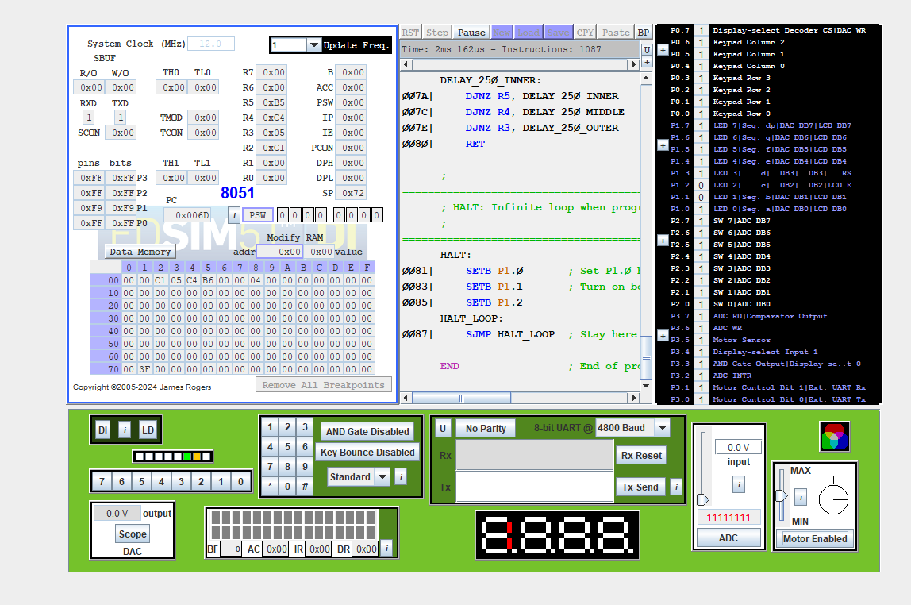

# Embedded Systems II - Software-Based Laboratory Exercises

This repository contains the assembly language source code for a series of laboratory exercises for an Embedded Systems II course based on the 8051 microcontroller. The labs are designed to be completed using a software simulator, with no hardware required.

## Overview of Labs

### [Lab 1: 8051 Assembly Fundamentals](./Lab%201/README.md)

This lab introduces the fundamentals of 8051 assembly language programming. It covers basic concepts such as:
*   Data movement and register manipulation.
*   Looping and iteration with 16-bit counters.
*   Basic I/O operations to control LEDs.
*   The use of subroutines for code modularity.

### [Lab 2: Basic I/O and Port Addressing](./Lab%202/README.md)

This lab delves deeper into I/O operations, with a focus on:
*   Bit-addressable I/O for fine-grained control of individual port pins.
*   Reading digital inputs from switches.
*   Implementing a software-based debouncing routine to handle the mechanical bouncing of switches.

### [Lab 3: Analog-Digital Interaction](./Lab%203/README.md)

This lab covers the simulation of analog-to-digital conversion and interfacing with a character LCD:
*   Simulating an external ADC to read analog values.
*   Using timer and external interrupts to manage the ADC conversion process.
*   Interfacing with a Hitachi HD44780-compatible character LCD in 4-bit mode.
*   Creating custom characters (CGRAM) to display a bar graph representation of the analog value.

## Simulator

The labs are designed to be run on an 8051 simulator. This repository includes the `edsim51di.jar` simulator.


### How to Run the Simulator

1.  **Java Requirement:** Ensure you have a Java Runtime Environment (JRE) installed on your system.
2.  **Navigate to the Simulator Directory:** Open a terminal or command prompt and navigate to the `Simulator_For_The_Labs` directory.
3.  **Run the Simulator:** Execute the following command:

    ```bash
    java -jar edsim51di.jar
    ```
4.  **Load a Program:** Once the simulator is open, you can load one of the `.asm` files from the lab directories to assemble and run it.

Alternatively, you can use other 8051 simulators, such as the online simulator at [https://8051-simulator.vercel.app/](https://8051-simulator.vercel.app/), as mentioned in the lab manual. You may need to copy and paste the code into the online simulator's editor.